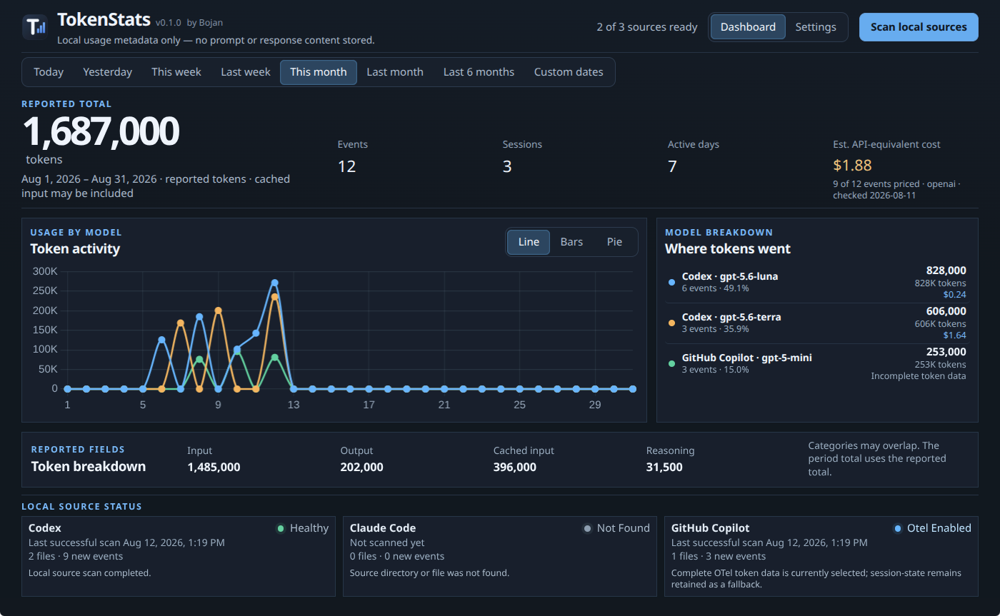

# TokenStats

TokenStats is a desktop app for tracking AI coding assistant token usage from
local logs.

It stores usage metadata in SQLite. Prompts, responses, source code, commands,
credentials, and raw logs are not stored.



> **Status:** An internal Fedora/Electron slice, tested on the current
> Fedora/KDE host. Local CI and tag-driven draft-release workflows now exist,
> but have not been pushed or run. Clean-machine, published-release, and
> cross-platform validation remain open.

## Current features

- Codex, Claude Code, and GitHub Copilot usage import.
- Optional GitHub Copilot OTel support.
- Dashboard with time periods, custom date ranges, and Line/Bar/Pie charts.
- Usage breakdown by source and model, with session counts.
- Estimated API-equivalent costs where pricing data is complete.
- Incremental imports and Settings reset with a verified SQLite backup.

## Run

```bash
pnpm install
pnpm dev
```

```bash
pnpm test
pnpm typecheck
pnpm build
pnpm release:check-version --stable-only -- v0.1.0
pnpm package:linux
```

Tray/background behavior, alerts, automatic updates, exports, and public
distribution are not implemented yet.

See the [documentation](docs/README.md) for details and [open questions](ideas/README.md)
for planned work.
